<picture>
  <source media="(prefers-color-scheme: dark)" srcset="assets/header-dark.svg">
  
</picture>

 

러닝 앱 [SyncRun](https://apps.apple.com/us/app/syncrun-solo-crew-running/id6803402900) 개발 중. 폰끼리 맞대면 그 자리에서 같이 뛰는 크루가 되는 앱. 2026년 7월 SyncRun Labs 공동창업, iOS 앱·서버·인프라 담당. 9월 9일 App Store 출시.

경북대 컴퓨터학부 재학, 2026년 제17대 학생회장. 2027년 2월 졸업 후 과학기술전문사관 11기로 국방과학연구소(ADD) 3년 복무 예정.

[포트폴리오](https://lsmin3388.github.io) · [블로그](https://velog.io/@sangminn) · [LinkedIn](https://www.linkedin.com/in/sangminn0) · sjsb4838@gmail.com

 

### 일한 곳

| 언제 | 어디서 | 뭘 했나 |
|:--|:--|:--|
| 2026.07 ~ | SyncRun Labs 공동창업자, CTO | SwiftUI 앱, NestJS·Socket.IO 서버, GCP 인프라. GPS와 만보기 값을 섞어 거리 측정, 여러 명의 러닝 기록 실시간 동기화. |
| 2026.01 ~ 02 | DataHouse Vietnam 백엔드 인턴, 다낭 | Node.js로 Slack 챗봇 TechTalk Hub 개발. DB와 화면 개선으로 응답시간 38% 단축. |
| 2025.05 ~ 2026.02 | R사 풀스택 개발자, 정규직 | 청년창업사관학교 선정 스타트업. 웹 서비스 프론트·백엔드 개발. |
| 2024.07 ~ 2025.03 | 해피에이징 산학 프로젝트, DevOps 리드 | 노인 낙상 방지 앱. 집 안 사진을 OpenAI로 분석해 넘어지기 쉬운 곳 탐지. [Spring Boot 서버](https://github.com/lsmin3388/fall-prevention-server)와 Kotlin 앱 개발, Google Play 출시. |
| 2023.06 ~ 2024.03 | 주식·금융 교육 스타트업 DevOps, 서버 | 코스피·코스닥 전 종목 실시간 시세 파이프라인 구축(Spring Webflux, RabbitMQ, InfluxDB). 모놀리식 서버를 MSA로 분리. |

### 학교에서

컴퓨터학부 학생 1,483명이 쓰는 학생회 플랫폼 개발·운영. Keycloak 기반 SSO, 학생회비 납부와 사물함 배정은 별도 서비스로 분리. 학부 물리서버에 Ubuntu, Docker Compose, Nginx, SSL 직접 구성. 배포는 GitHub Actions.

2024~2025년 과대표, 2026년 제17대 학생회장.

### 연구

- 편광이 다른 SAR 영상을 정합·합성해 단일 영상에서 안 보이던 표적 탐지. KAIST 차세대 SAR 연구실 지도, 밀리테크 챌린지 2025 대상.
- 시계열 임베딩 모델 5종을 데이터셋 4개에서 군집화 성능 비교. KSC 2025 공저.
- 드론 버티포트용 웹 CCTV 통합 감시 시스템. 한국정보기술학회 2026 하계 대학생논문경진대회 동상.

두 번째, 세 번째 결과물은 SW 저작권 등록(C-2026-000148, C-2026-030871, 저작자 경북대 산학협력단). 자세한 내용은 [연구 페이지](https://lsmin3388.github.io/research.html).

### 상

- 2025.12 &nbsp;제6회 밀리테크 챌린지 대상(과기정통부 장관상), 모범상
- 2026.06 &nbsp;한국정보기술학회 대학생논문경진대회 동상
- 2026.05 &nbsp;AI·SW중심대학 에세이 공모전 대상, AI선정상 · [에세이](https://lsmin3388.github.io/essay.html)
- 2025.07 &nbsp;제23회 TOPCIT 특별상, 교내 1위(805점)

나머지

- 2024.11 &nbsp;월드프렌즈코리아 IT봉사단 장려상. 인도네시아, 소 품종·무게 측정 서비스 개발
- 2023.11 &nbsp;대구를 빛내는 SW 해커톤 최우수상. 블록체인 기반 교육권 침해 신고 서비스
- SW교육원 아이디어 해커톤 대상. 대구·경북 5개 대학 참가
- 국가우수장학금(이공계), 샘 인재 발전기금

### 같이 한 곳

- 멋쟁이사자처럼 11~13기. 12·13기 BE 운영진으로 Spring Boot 커리큘럼 설계·강의
- GDG on Campus KNU 백엔드 코어 멤버
- 구름톤 KNU 3·4기 백엔드 운영진

 

2026.09 수정
